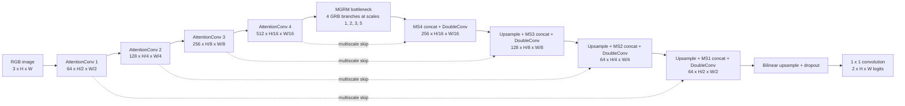
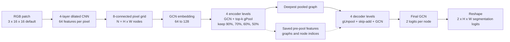

# Landslide Segmentation with Graph Neural Networks

PyTorch research prototypes for remote-sensing landslide segmentation with
transfer learning, attention U-Net components, graph reasoning, and Graph U-Net.

**Keywords:** landslide detection, semantic segmentation, remote sensing,
satellite imagery, graph neural network, Graph U-Net, transfer learning,
AMMG-UNet, PyTorch.


> **Research status:** source code and tests are published; datasets,
> checkpoints, paper PDFs, and generated results are intentionally excluded.
> The models are experimental and are not presented as validated disaster
> response systems.

## Evidence at a glance

| Reproduction check | Measured evidence | Result |
| --- | --- | --- |
| Software checks | Component, split, dataset, and notebook checks | **17/17 passed** |
| Headline paper modules | Attention convolution, multiscale connection, MGRM, and GRB | **4/4 present - 100% concept coverage** |
| Parameter scale | 15,849,914 local parameters / 48.1M reported | **Materially smaller** |
| CAS source-data coverage | 4,273 / 20,865 matched image-mask pairs | **Partial local copy** |
| Paper-comparable full experiment | Training and benchmark metrics were not rerun | **Not validated** |
| Defensible overall reproduction claim | Requires architecture, data, protocol, and comparable held-out results | **No clone percentage published** |

**Important:** 100% concept coverage only means that all four named ideas appear
in the code. It is not 100% architectural fidelity or paper reproduction.
Because major blocks differ and the full benchmark was not rerun, an overall
80% or greater clone claim cannot be defended. This work is therefore presented
as a **simplified AMMG-style prototype**.

## What is included

| Component | Purpose | Status |
| --- | --- | --- |
| [Simplified AMMG-style U-Net](ammg_unet/) | Attention, multiscale skips, graph-reasoning bottleneck, and four transfer-learning conditions | Runnable research prototype; not a faithful paper reproduction |
| [Graph U-Net experiments](graph_unet/) | Dense pixel-grid package plus a SLIC-superpixel Colab notebook | Component-tested prototype; the two variants are separate experiments |
| [Reproducibility notes](docs/REPRODUCIBILITY.md) | Architecture comparison, split rules, dataset controls, tests, and known limitations | Required reading before reporting metrics |

The two model families are related by the research question, not by checkpoint
compatibility:

```text
Luo et al. landslide paper
  -> simplified AMMG-style CNN/graph-reasoning prototype

Gao and Ji Graph U-Nets
  -> dense pixel-grid Graph U-Net prototype
  -> SLIC-superpixel Graph U-Net notebook

Downloaded CAS / Hokkaido / Bijie data
  -> local-only inputs (never committed)
```

## Architecture preview

These diagrams are generated from the committed model code and render directly
on GitHub. A prediction screenshot is intentionally not shown because the
cleaned notebook contains no validated benchmark output.

### Simplified AMMG-style U-Net



### Dense pixel-grid Graph U-Net



The cleaned Colab notebook is a separate SLIC-superpixel Graph U-Net variant,
not another view of the dense pixel-grid model.

## Why the repository is source-only

The working directory contains tens of gigabytes of downloaded imagery,
archives, trained weights, plots, papers, and duplicate experiments. Several
weight files exceed GitHub's 100 MB per-file limit. The repository therefore
uses a strict ignore policy and publishes only reviewed source, tests,
documentation, and attribution notices.

The publisher PDF is not redistributed. Use the paper DOI below.

## Quick start

Python 3.10 or newer is recommended.

```bash
git clone https://github.com/Sriman-Kunda-056/landslide-segmentation-gnn.git
cd landslide-segmentation-gnn

python -m venv .venv
# Windows: .venv\Scripts\activate
# Linux/macOS: source .venv/bin/activate

pip install torch torchvision
```

Install and validate one component:

```bash
cd ammg_unet
pip install -r requirements.txt
python test_components.py
python -m unittest test_splits.py
```

or:

```bash
cd graph_unet
pip install -r requirements.txt
python test_components.py
python -m unittest test_dataset.py
```

See each component README for data layout and training commands.

## Dataset policy

No dataset is included. Place downloaded files under the component's
`dataset/` directory, which is ignored by Git.

- **CAS Landslide Dataset:** use the dataset publication and verify its license,
  region manifest, and checksums.
- **Hokkaido:** verify image/mask alignment, spatial resolution, patching, nodata
  values, and redistribution terms.
- **Bijie:** verify the exact release and binary-mask encoding used in an
  experiment.

Dataset references used by the local project include the
[CAS Landslide Dataset publication](https://doi.org/10.1038/s41597-023-02847-z)
and the [Bijie dataset location](https://github.com/SDU-L/CLPD/tree/main/dataset).

For transfer learning, exclude every target-region image from the source-domain
pretraining manifest. Save exact train/validation/test manifests and checksums
with any published result.

## Scientific interpretation

- The AMMG-style model has about 15.85M parameters, while the paper reports
  48.1M for AMMG-UNet. Its architecture, head, loss, and normalization differ.
- The dense Graph U-Net prototype is intentionally limited to a tiny
  `16x16` grid because its current adjacency and graph-power operations do not
  scale to useful image resolutions.
- The notebook uses superpixels and reports node-weighted metrics. Those metrics
  are not directly comparable with pixel-weighted segmentation metrics.
- No paper table or transfer-learning benefit is claimed as reproduced here.

## References

1. W. Luo, H. Qiu, Y. Wei, et al., "A proposed method for landslide
   detection based on transfer learning and graph neural network,"
   *Geoscience Frontiers*, 16 (2025), 102171.
   https://doi.org/10.1016/j.gsf.2025.102171
2. H. Gao and S. Ji, "Graph U-Nets," *Proceedings of Machine Learning
   Research*, 97 (ICML 2019), 2083-2092.
   https://proceedings.mlr.press/v97/gao19a.html
3. Official AMMG-UNet code linked by the landslide paper:
   https://github.com/anon-nameless/TL-landslide_detection
4. Graph U-Nets reference implementation:
   https://github.com/HongyangGao/Graph-U-Nets

## Numbered commit history

1. `01` - initialize the source-only repository and ignore policy.
2. `02` - add the simplified AMMG-style implementation.
3. `03` - add Graph U-Net scripts and the cleaned Colab notebook.
4. `04` - fix reproducibility and experimental controls.
5. `05` - document architecture, attribution, setup, and limitations.
6. `06` - add an evidence scorecard and GitHub-rendered architecture diagrams.

## Suggested GitHub topics

`landslide-detection` `semantic-segmentation` `graph-neural-network`
`graph-unet` `remote-sensing` `transfer-learning` `pytorch`

## Citation and third-party material

Use [CITATION.cff](CITATION.cff) to cite this software repository. Upstream
attribution and data/paper distribution notes are recorded in
[THIRD_PARTY_NOTICES.md](THIRD_PARTY_NOTICES.md).

No repository-wide license has been selected in this release. The preserved
upstream MIT notice applies to the upstream material it covers; it does not by
itself license every file in this repository.
